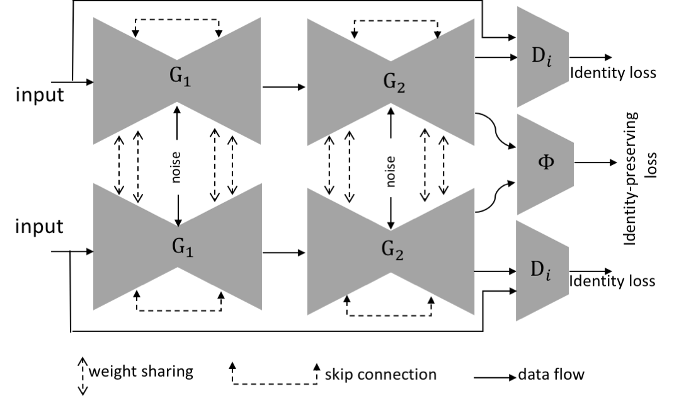
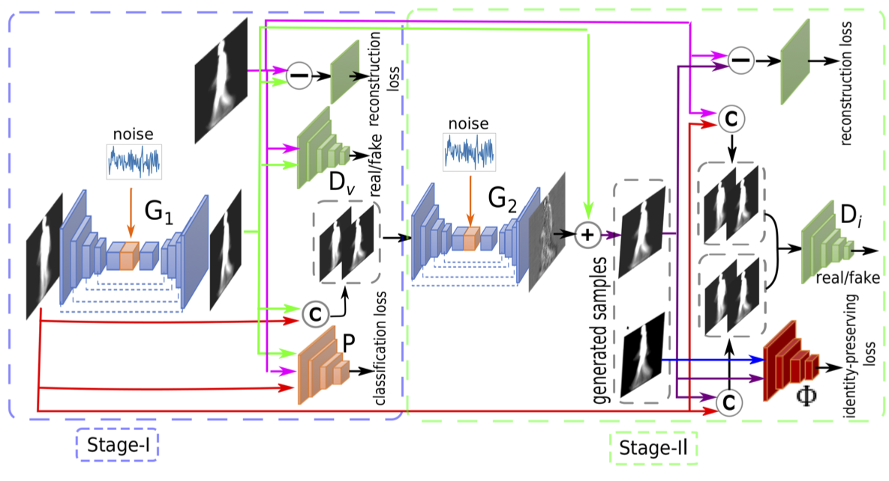

# VN-GAN
An tensorflow implementation of VN-GAN. The framework is as follow,
* Framework of VN-GAN

<div align=center>

</div>

* Two-stage structure
<div align=center>

</div>

## Requirements
* tensorflow 
* PIL
* matplotlib
* numpy
* logging
* shutil

## Dataset

Download the CASIA gait dataset B from http://www.cbsr.ia.ac.cn/english/Gait%20Databases.asp and put it in directory './data'.
## Usage

For training, run

```
python run.py --is_train --batch_size 100
```

For generation, run

```
python run.py --batch_size 1
```
## Examples

Attached are some examples, the first column are inputs, the first row are references, and the bottom 11 x 11 are generated gaits,


